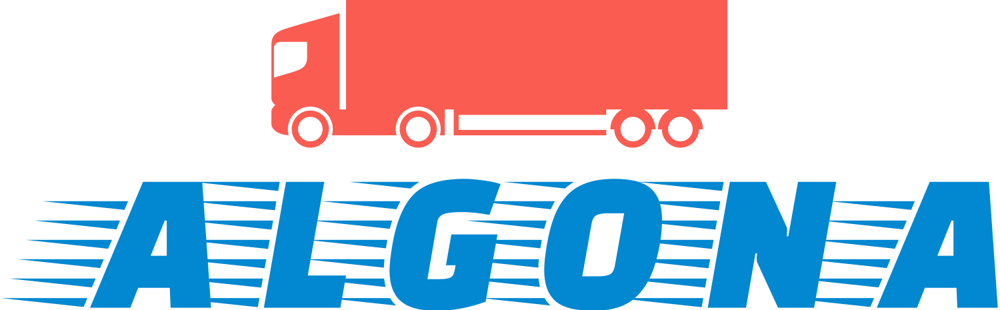

# Algona

     

## Overview 

**Welcome to Algona LTD - International transport and spedition management company.**

Algona is designed to streamline and optimize transportation operations for businesses and private persons, providing a user-friendly interface to manage various aspects of the transportation process.    
It's easy to use, with intuitive design and fully responsive content visualisation in order to be accessible on every device clients use.

## Features

- **User Authentication**: Securely manage user access with authentication to ensure data privacy and integrity. Also provides extra services as request transport and real-time Tracking of orders.

- **Request Transport Functionality**: Users can easily request transport both international and spedition.  

- **Real-time Tracking**: Track the real-time location of vehicles to ensure accurate and timely deliveries.

- **Route Planning**: Efficiently plan and optimize transportation routes to minimize travel time and costs.

- **News and Updates**: Regularly updated news and announcements about the company and provided transportation services.

- **Career Support**: User-friendly interface for easy job apply.

- **Users' questions/feedback support**: Handles all kinds of questions/feedback made via Contact form.

- **Vehicle Management**: Keep track of company vehicles for better planning and coordination.

## Getting Started

To get started with Algona, follow steps described bellow:

1. **Clone the Repository**: `git clone [https://github.com/IvanovvAlex/Algona.git]`

2. **Install Dependencies**: `npm install` or `yarn install`

3. **Configure Database**: Set up and configure the database connection in the `appsettings.json` file.

4. **Run the Application**: `ng serve` or `yarn start`

5. **Access the App**: Open your browser and navigate to `http://localhost:4200`
(or if you use yarn - `http://localhost:4500`) to access the application.

## Technologies Used

- **Frontend**: Angular (Typescript, RxJS, Material Design, Bootstrap, HTML, CSS)
- **Backend**: C#, ASP.NET Core Web API + EF Core
- **Database**: MS SQL
- **Authentication**: Azure AD (JSON Web Tokens (JWT))

## Support and Feedback

For any issues or feedback, please contact [notifications@github.com].

Thank you for using **Algona**! Happy transporting! 🚚🌐